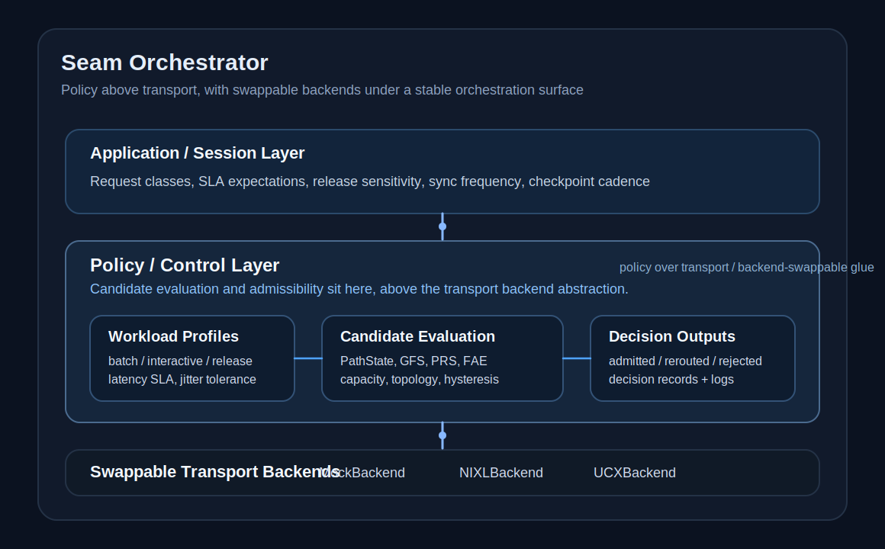

# Seam Orchestrator

**A policy layer above transport for KV movement, workload-aware admissibility, and routing in disaggregated inference.**

Disaggregated inference introduces a new control boundary between heterogeneous prefill and decode domains. While transport backends handle the mechanics of byte movement, the critical orchestration challenge is policy: *Is this specific path admissible for this specific workload, right now?*

Seam Orchestrator is a reference implementation of this policy layer. It sits above swappable transport backends (e.g., NIXL, UCX, or mock providers), evaluates routing candidates through workload-aware admission logic, and emits auditable **Decision Records**. This transforms implicit routing choices into a programmable, auditable systems artifact.

> KV cache transfer is not merely a transport problem; it is a policy problem at the seam of disaggregated systems.

## What This Repo Is

`seam-orchestrator` is a transport-agnostic orchestration layer designed to govern KV movement. It demonstrates that the "glue" between prefill and decode is a high-leverage control point where systems can apply workload-relative admission, tail-latency protection, and capacity-aware routing.

**The Core Thesis:**
1. **Transport is a primitive:** The question is no longer just "can bytes move?"
2. **Policy is the differentiator:** The strategic question is "should this path be used for this workload under current conditions?"

## What This Repo Is Not

*   **Not a NIXL replacement:** It does not aim for production parity with mature transport stacks like UCX or libfabric.
*   **Not a benchmark war:** It is not intended for transport micro-benchmarking.
*   **Not a failure-injection toy:** While it handles gray failures, it is a policy framework, not just a testing tool.
*   **Not a generic dashboard:** It is a functional control-plane prototype.

While the transport backend is intentionally narrow, the repo defines a **replacement-capable prototype path**, proving that the orchestration logic is decoupled from the underlying wire protocol.

## Why This Matters: The Control Point Shift

As inference disaggregates, prefill and decode often move to different accelerators, domains, or fabrics (e.g., [AWS NIXL with EFA](https://aws.amazon.com/about-aws/whats-new/2026/03/aws-support-nixl-with-efa/) or [Cerebras on AWS](https://www.cerebras.ai/blog/cerebras-is-coming-to-aws)). This creates a new systems boundary. 

At this "seam," the orchestrator must resolve complex trade-offs that transport layers ignore:
*   **Workload Admissibility:** Is a degraded path acceptable for batch traffic but too risky for release-critical interactive requests?
*   **Tail-Risk Management:** Can we prevent a jittery path from poisoning $p99$ behavior before a hard failure occurs?
*   **Headroom Preservation:** Should we save the healthiest paths for the strictest SLAs, even if it means routing tolerant work over "good enough" degraded paths?

## Architecture



The orchestrator sits between the session layer and the transport layer. It evaluates **Candidates**—tuples of Pool, Path, and Telemetry—to emit a deterministic routing choice.

### Core Terminology
*   **Pool:** A decode resource group.
*   **Path:** The transfer route to a specific pool.
*   **Candidate:** A pool+path pairing with an active telemetry snapshot.
*   **Admissibility:** A workload-specific boolean check (e.g., "Is this path safe for this SLA?").

## Can the glue layer be replaced?

**A replacement-capable prototype path exists.** 

This project demonstrates that the orchestration surface is independent of the transport implementation. Whether using a NIXL-backed path or a direct RDMA backend, the higher-leverage logic—admissibility, routing hysteresis, and tail-risk handling—remains consistent. While we do not claim production parity with mature stacks, we prove that the backend abstraction is real and that the strategic value of the system sits *above* the wire.

## The Audit Loop: Decision Records, $p99$, and Replay

Seam Orchestrator ties three concepts together into a coherent audit loop:

1.  **Decision Records:** Every routing choice generates a structured explanation. This moves beyond "what happened" (transfer success) to "why it happened" (e.g., "rejected for jitter budget" or "rerouted to preserve healthy headroom").
2.  **Tail-Latency ($p99$) Protection:** By treating latency and jitter as continuous signals rather than binary health, the orchestrator proactively protects strict SLAs from path degradation.
3.  **Replayability:** Replay artifacts (JSONL/Markdown) allow researchers to audit decisions against synthetic or captured traces, making the value proposition concrete and testable.

---

## Core Concepts & Scoring Transparency

The scoring model is intentionally legible and configurable, avoiding "black box" routing.

| Concept | Identifier | Purpose |
| :--- | :--- | :--- |
| **Path State** | `PathState` | Non-binary health: `HEALTHY`, `DEGRADED_USABLE`, `DEGRADED_RESTRICTED`, `QUARANTINE`. |
| **Gray Failure Score** | `GFS` | A weighted multi-signal score (latency, jitter, drops) triggering escalation. |
| **Propagation Risk** | `PRS` | Estimates the risk of a placement choice spreading based on alternate scarcity. |
| **Failure Amplification** | `FAE` | Connects local degradation to cluster-level blast radius. |

### Scoring Transparency
Weights and thresholds are explicit, not opaque. For example, `GFS` weighs $p99$ latency at $0.45$ and jitter at $0.30$ by default to prioritize tail-latency protection. 
> [!TIP]
> Full formulas, configurable weights, and threshold logic are documented in [docs/scoring-spec.md](docs/scoring-spec.md).

---

## Scenario Narrative: Admissibility vs. Trade-off

### Scenario E: Workload-Relative Admissibility
*The "p99 Protection" Demo.*
In this scenario, a path is still "up" (transfers succeed) but exhibits elevated jitter. 
*   **Result:** The orchestrator deems the path admissible for **Batch** (payloads move) but rejects it for **Interactive** traffic to protect the user experience from tail-latency poisoning.
*   **Takeaway:** Health is not binary; it is relative to the workload's SLA.

### Scenario F: Capacity vs. Health Trade-off
*The "Operational Policy" Demo.*
What happens when the "healthiest" path is nearly full? 
*   **Result:** The orchestrator routes **Batch** traffic to a slightly degraded (but roomy) path to **preserve healthy headroom** for incoming **Release-Critical** requests.
*   **Takeaway:** The "best" path is a function of both raw health and systemic capacity pressure.

## Experimental Evidence & Replay

The repo includes a full simulation and evaluation suite that generates auditable artifacts.

### Headline Metrics
*   **Strict Workload Preservation:** `95.5%` of high-criticality requests kept on HSL-compliant paths.
*   **Degraded Capacity Exploitation:** `82.6%` of tolerant requests successfully used "still-alive" degraded paths.
*   **Headroom Preservation:** `100.0%` success in reserving healthy paths during capacity pressure events.

### Replay Auditability
Replay makes the value proposition testable by comparing Seam Orchestrator against naive policies (e.g., `lowest_latency` or `binary_health_only`) using the same request trace.

| Policy | Strict Healthy % | Tolerant Degraded % | Decision Audit |
| :--- | :---: | :---: | :--- |
| `lowest_latency` | 33.3% | 75.0% | Often chases jittery "fast" paths. |
| `binary_health_only` | 66.7% | 50.0% | Wastes usable degraded capacity. |
| **Seam Orchestrator** | **66.7%** | **100.0%** | **Protects tail while maximizing utility.** |

---

## Repository Layout

```text
├── orchestrator.py    # Core policy, scoring, and admission logic
├── transport.py       # Swappable backend interface (NIXL, UCX, Mock)
├── simulate.py        # Scenario-based execution (E, F, all)
├── evaluate.py        # Artifact generation and metric evaluation
├── replay.py          # Trace-based policy comparison tool
├── docs/              # Detailed specs (scoring, architecture, path)
└── outputs/           # Replayable decision traces and summaries
```

## Quick Start

```bash
# Run the core policy demos
python simulate.py --scenario E
python simulate.py --scenario F

# Run evaluation and generate all artifacts
python evaluate.py

# Compare Seam Orchestrator against naive policies
python replay.py
```

## Further Reading
*   [Scoring Specification](docs/scoring-spec.md) - Deep dive into GFS/PRS/FAE math.
*   [Architecture Deep Dive](docs/architecture.md) - Component interactions and state machine.
*   [Replacement Path](docs/replacement-path.md) - The roadmap for backend integration.
