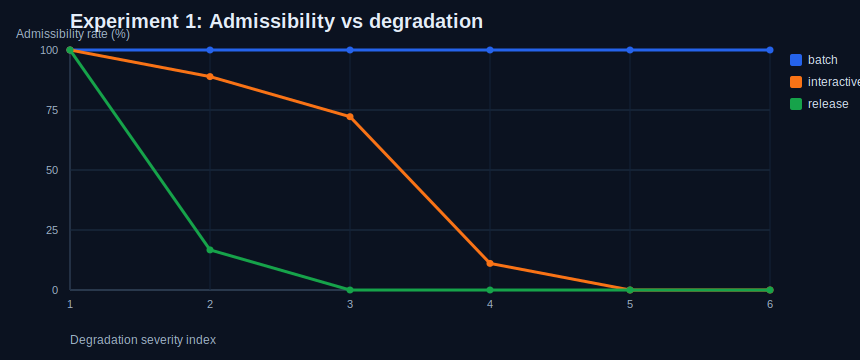
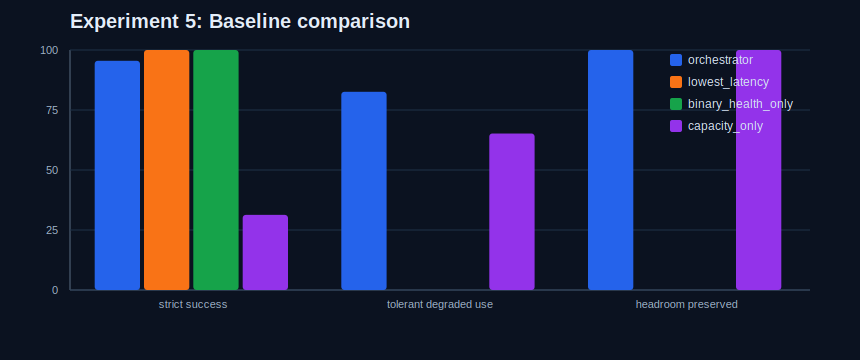

# Seam Orchestrator

A policy layer above transport for KV movement, workload-aware admissibility, and routing in disaggregated inference.

Disaggregated inference needs a glue layer between heterogeneous prefill and decode domains. Transport is necessary, but it is not the whole control problem. The interesting systems question is no longer only "can bytes move?" It is "is this path admissible for this workload right now?"

Seam Orchestrator explores that layer above transport. It sits above swappable transport backends such as mock transport, NIXL, or UCX, evaluates candidates using workload-aware policy, and emits auditable decision records for routing choices that would otherwise remain implicit.

> KV cache transfer is not only a transport problem. In disaggregated inference, it becomes a policy problem at the seam between heterogeneous prefill and decode domains.

## What This Repo Is

`seam-orchestrator` is a transport-agnostic orchestration layer for KV movement in disaggregated inference. It is designed as a policy/control layer above transport backends. It also demonstrates that the KV-transfer glue layer is prototypeable and backend-swappable, without claiming production parity with mature transport stacks.

The thesis is:

- The interesting question is not only "can bytes move?"
- The interesting question is "should this path be used for this workload right now?"

That control point becomes strategically important in disaggregated systems, where KV transfer sits on the seam between prefill and decode.

## What This Repo Is Not

- Not a full NIXL clone.
- Not a full replacement for UCX, libfabric, or production RDMA transport stacks.
- Not just a failure-injection toy.
- Not a generic monitoring dashboard.
- Not a transport microbenchmark project.

The transport backend remains intentionally narrow. Transport itself is still complex and important. The main artifact here is the policy layer above transport, even though the repo also demonstrates a credible replacement-capable prototype path for the glue layer.

## Why This Matters

Disaggregated inference creates a new systems boundary: the seam between prefill and decode. Prefill and decode can live on different domains, different accelerators, and different transport fabrics. Once KV state moves across that seam, the important systems question is no longer only whether bytes can move. The system has to decide:

- Is this path admissible for release-critical traffic right now?
- Should a degraded but still-live path remain open for batch traffic only?
- Is the healthier pool too close to capacity to spend on tolerant work?
- Does alternate-path scarcity change the risk of using a given pool?

AWS publicly announced support for NIXL with EFA for LLM inference workloads, and AWS/Cerebras publicly described a disaggregated deployment where Trainium performs prefill, Cerebras performs decode, and KV cache moves over EFA between them. That is the broader context for this repo: the strategic control point may shift from byte movement alone to interface, admissibility, routing, and policy above transport.

References:

- [AWS adds support for NIXL with EFA](https://aws.amazon.com/about-aws/whats-new/2026/03/aws-support-nixl-with-efa/)
- [Cerebras is coming to AWS](https://www.cerebras.ai/blog/cerebras-is-coming-to-aws)

## Architecture


The application/session layer decides that a request needs decode capacity. Seam Orchestrator evaluates candidate paths, applies workload-aware admissibility and routing policy, and emits decision records. The transport backend below it only moves KV state.

Caption: the orchestrator owns admissibility, scoring, and routing; the transport backend is intentionally swappable underneath that layer.

### Terminology

| Term | Meaning |
| --- | --- |
| pool | decode resource group |
| path | transfer path to that pool |
| candidate | pool + path + state snapshot |

## Can the glue layer be replaced?

Yes, in prototype form.

This repo demonstrates that the KV-transfer glue layer is not irreducibly tied to one backend implementation. A mock backend, a NIXL-backed path, a UCX-backed path, and future direct backends can all sit behind the same orchestration surface.

That does not mean this repo is claiming production parity with mature transport stacks. Transport remains important and difficult. The point is narrower and more defensible: a replacement-capable prototype path exists, the backend abstraction is real, and much of the strategically interesting software value sits above transport in admissibility, routing, hysteresis, tail-risk handling, and decision records.

## Layer Responsibilities

| Concern | Transport backend layer | Seam Orchestrator layer |
| --- | --- | --- |
| Byte movement | Moves KV payloads between endpoints | Consumes transport outcomes but does not implement wire-level transport |
| Backend compatibility | NIXL / UCX / mock / future direct backends | Works above any backend that satisfies the transport interface |
| Workload-aware admissibility | Not responsible | Core responsibility |
| Routing under degraded conditions | Not responsible | Core responsibility |
| Capacity-aware policy | Not responsible | Core responsibility |
| Hysteresis / staged restore | Not responsible | Core responsibility |
| Decision records / explainability | Not responsible | Core responsibility |

## Core Concepts

| Concept | Purpose |
| --- | --- |
| `PathState` | Non-binary path health model: `HEALTHY`, `DEGRADED_USABLE`, `DEGRADED_RESTRICTED`, `QUARANTINE_CANDIDATE`, `QUARANTINED`, `RESTORED`. |
| `GFS` | Gray Failure Score. A weighted multi-signal score over latency, jitter, drop behavior, plus a cross-signal interaction term. |
| `PRS` | Propagation Risk Score. Estimates how much a bad routing choice could spread risk based on workload sensitivity, path dependence, and alternate-path scarcity. |
| `FAE` | Failure Amplification Estimate. Connects local degradation to cluster-level blast radius. |
| `WorkloadProfile` | Workload descriptor carrying latency SLA, jitter tolerance, sync frequency, checkpoint size, and release sensitivity. |
| Decision record | Structured explanation object with `PathState`, `GFS`, `PRS`, `FAE`, admissibility, capacity, topology dependence, and chosen/skipped reason. |
| Hysteresis and staged restore | Fast escalation, slower recovery, and staged restore to avoid flapping. |

## Why Decision Records Matter

Transport can tell you what happened at transfer level. Seam Orchestrator adds a decision layer that can tell you why a routing choice was made.

- Why a candidate stayed admissible for batch but not for release-sensitive work.
- Why a lower-latency but jitterier path was rejected for stricter traffic.
- Why a healthier pool was preserved for tail-sensitive workloads instead of spent on tolerant work.
- Why a reroute happened instead of a reject.

That makes the artifact more auditable than a pure transfer metric stream. Under gray degradation, the decision record is the control-plane audit trail: not just what happened on the wire, but why the policy chose to admit, reject, reroute, or preserve headroom.

## Tail-Latency Protection

One of the main values of the orchestrator is keeping strict or release-sensitive requests off still-alive but jittery paths that can poison `p99` behavior.

- `p99` latency is checked directly against workload SLA.
- Jitter-sensitive workloads apply a tighter jitter budget.
- Healthy headroom can be preserved for stricter workloads, even when a degraded path remains admissible for tolerant work.

The goal is not to claim a universal `p99` guarantee. The goal is to make tail-risk-aware routing explicit and explainable, especially in the still-alive but unstable conditions that Scenario E is meant to surface.

## Why Not Just Use NIXL Directly?

NIXL and similar transport layers solve byte movement. Seam Orchestrator solves workload-aware admissibility and routing above transport.

- transport backend: can the KV payload move?
- orchestrator: should this candidate path carry this workload now?

These layers are complementary, not mutually exclusive.

## Scenario E: Category-Defining Demo

Scenario E is the core proof of the thesis.

- The path is still up.
- Transfers still succeed.
- There is no hard failure.
- The path remains admissible for tolerant traffic.
- The same path is not admissible for stricter workloads.

Same path. Same transfer mechanism. Different admissibility by workload.

### Scenario E Summary

| Candidate path | Observed condition | `PathState` | Batch admissibility | Interactive admissibility | Release-critical admissibility |
| --- | --- | --- | --- | --- | --- |
| `pool-0-degraded` | Reachable, elevated latency and jitter, KV transfer still succeeds | `DEGRADED_USABLE` | Admissible | Not admissible | Not admissible |
| `pool-1-healthy` | Clean backup path with low latency and low jitter | `HEALTHY` | Admissible | Admissible | Admissible |

Takeaway: a path can remain live, transfer successfully, and still become workload-selective rather than universally usable.

### Why Scenario E Matters

This is the point of the project:

- Health is not binary.
- Admissibility is workload-relative.
- A still-alive path can be acceptable for low-criticality traffic and unacceptable for strict-SLA traffic.
- That split is also a form of tail-latency protection: stricter workloads are kept off the jitterier path before long-tail behavior becomes the dominant failure mode.

## Scenario F: Capacity Pressure Under Gray Failure

Scenario F extends the thesis from admissibility into policy tradeoffs.

- One candidate path is healthier but near its soft capacity threshold.
- Another candidate path is degraded but still admissible for tolerant work.
- The orchestrator preserves the healthier path for stricter workloads and uses the degraded path for capacity-tolerant work when headroom matters more than raw health.

That makes the artifact stronger as a control-layer prototype: the healthiest path is not always the right choice when headroom is scarce.

Preserving scarce healthy headroom can matter more than always selecting the best raw health score.

### Scenario F Summary

| Candidate path | Health posture | Capacity posture | Policy outcome |
| --- | --- | --- | --- |
| `pool-healthy-tight` | `HEALTHY` | Near soft limit | Preserved for stricter workloads |
| `pool-degraded-roomy` | `DEGRADED_USABLE` | More headroom | Used for tolerant work when admissible |

Takeaway: the healthiest path is not always the selected path when policy must protect headroom for stricter work.

## Explainability and Logs

Routing stays decomposable rather than collapsing into one opaque score:

1. Evaluate `PathState` and recent telemetry.
2. Compute `GFS`, `PRS`, and `FAE`.
3. Check workload-aware admissibility.
4. Evaluate capacity snapshot and alternate-path dependence.
5. Select from admissible paths using an explicit selection policy.

Every route decision produces a decision record with:

- candidate id
- `PathState`
- `GFS`
- `PRS`
- `FAE`
- admissible yes/no
- primary reason
- capacity snapshot
- chosen / skipped
- skipped reason

Structured JSONL event logs are written under `outputs/` and include:

- state transitions
- restore events
- admissions
- rejections
- reroutes

## Results

Representative simulator output:

```text
Workload    | Chosen path     | Outcome               | Routing rationale
------------+-----------------+-----------------------+--------------------------------------------------------------
batch       | pool-0-degraded | rerouted_to_alternate | headroom_first selected pool-0-degraded over healthier pool-1-healthy
interactive | pool-1-healthy  | admitted              | healthy admissible pool selected
release     | pool-1-healthy  | admitted              | healthy admissible pool selected
```

Lightweight evaluation highlights from `python evaluate.py`:

- strict workloads preserved on healthy paths: `97.9%`
- tolerant workloads admitted to degraded-but-usable paths: `91.7%`
- capacity-pressure batch reroutes observed: `24 / 24` evaluation trials

Replay highlights from `python replay.py` on `data/sample_trace.csv`:

- `seam_orchestrator` kept `66.7%` of strict requests on healthy paths, matching `binary_health_only`
- `seam_orchestrator` admitted `100.0%` of tolerant batch requests onto degraded-but-usable paths when appropriate
- `lowest_latency` dropped to `33.3%` strict healthy placement by chasing lower-latency but jitterier paths

Representative replay comparison:

```text
Request  | Workload     | Lowest latency | Binary health | Capacity only | Seam Orchestrator
---------+--------------+----------------+---------------+---------------+-------------------
req-002  | interactive  | pool-degraded  | pool-healthy  | pool-degraded | pool-healthy
req-005  | interactive  | pool-degraded  | pool-healthy-a| pool-degraded | pool-healthy-a
req-004  | batch        | pool-healthy-a | pool-healthy-a| pool-degraded | pool-degraded
```

Committed result artifacts:

- [outputs/scenario_summary.md](outputs/scenario_summary.md)
- [outputs/scenario_e_snippet.md](outputs/scenario_e_snippet.md)
- [outputs/scenario_f_snippet.md](outputs/scenario_f_snippet.md)
- [outputs/scenario_e_table.md](outputs/scenario_e_table.md)
- [outputs/scenario_f_table.md](outputs/scenario_f_table.md)
- [outputs/candidate_evaluation_example.md](outputs/candidate_evaluation_example.md)
- [outputs/decision_trace_scenario_e.json](outputs/decision_trace_scenario_e.json)
- [outputs/decision_trace_scenario_f.json](outputs/decision_trace_scenario_f.json)
- [outputs/evaluation_summary.md](outputs/evaluation_summary.md)
- [outputs/replay_summary.md](outputs/replay_summary.md)
- [outputs/replay_comparison_table.md](outputs/replay_comparison_table.md)

## Experimental Results

The scenario demos show the thesis. The experiment harness adds controlled evidence. These runs are not transport benchmarks; they measure workload-aware admissibility, routing under gray degradation, healthy-path preservation, hysteresis stability, and alternate-path scarcity above the transport backend.

### Headline Metrics

| Metric | Result |
| --- | --- |
| Strict workloads preserved on healthy paths | `95.5%` |
| Tolerant workloads admitted to degraded-but-usable paths | `82.6%` |
| Healthy-headroom preservation in headroom-opportunity cases | `100.0%` |
| Hysteresis oscillations avoided vs no-hysteresis baseline | `7` |

### Admissibility Boundary Sweep

Scenario E scales into a real sweep: the same candidate path remains admissible for batch traffic substantially longer than for interactive or release-sensitive work as latency inflation and jitter rise.



### Baseline Comparison

Simple baselines miss critical policy information. Lowest-latency and binary-health-only preserve strict traffic well in these synthetic trials, but they fail to exploit degraded-but-usable capacity and fail to preserve healthy headroom intentionally. Capacity-only does preserve headroom, but at a major strict-workload cost.



### Replay Comparison

Replay makes the routing surface more auditable by comparing the same request trace across naive policies and Seam Orchestrator.

| Policy | Strict healthy % | Tolerant degraded % | Strict protected | Headroom preserved |
| --- | --- | --- | --- | --- |
| `lowest_latency` | `33.3%` | `75.0%` | `0` | `1` |
| `binary_health_only` | `66.7%` | `50.0%` | `2` | `0` |
| `capacity_only` | `33.3%` | `100.0%` | `0` | `2` |
| `seam_orchestrator` | `66.7%` | `100.0%` | `2` | `2` |

Replay takeaway: naive routing can protect one axis at the expense of another. Seam Orchestrator keeps the decision record, the tail-risk guardrails, and the headroom tradeoff in the same auditable control loop.

Committed experiment artifacts:

- [outputs/experiment_summary.md](outputs/experiment_summary.md)
- [outputs/experiment_admissibility_boundary.md](outputs/experiment_admissibility_boundary.md)
- [outputs/experiment_capacity_tradeoff.md](outputs/experiment_capacity_tradeoff.md)
- [outputs/experiment_hysteresis_stability.md](outputs/experiment_hysteresis_stability.md)
- [outputs/experiment_alternate_scarcity.md](outputs/experiment_alternate_scarcity.md)
- [outputs/experiment_baseline_comparison.md](outputs/experiment_baseline_comparison.md)
- [outputs/replay_summary.md](outputs/replay_summary.md)

## What the experiments show

- Health is workload-relative. The same degraded path is acceptable for tolerant batch traffic longer than for interactive or release-sensitive traffic.
- Healthy-path preservation matters. The healthiest path is not always the right path when its headroom should be reserved for high-criticality work.
- Degraded-but-usable paths can be exploited safely for tolerant traffic. That is a policy decision, not a transport primitive.
- Hysteresis prevents flapping. Staged restore reduces oscillation under noisy conditions.
- Alternate-path scarcity changes the decision materially by raising `PRS` and `FAE`.
- Naive routing loses important information. Lowest-latency, binary-health-only, and capacity-only each discard different parts of the control problem.
- Replay makes the value proposition auditable. The same request trace can be re-evaluated side by side, with decision records showing why a stricter request stayed on a healthier path or why tolerant work absorbed degraded capacity.

## Scoring Model / Spec

The scoring model is intentionally explicit rather than opaque.

- `GFS` summarizes local gray degradation from latency, jitter, drop behavior, and a small interaction term.
- `PRS` estimates how much a bad placement choice could propagate risk based on topology, alternate-path scarcity, state severity, and workload sensitivity.
- `FAE` estimates how local degradation can amplify into broader useful-work loss or blast radius.
- Workload-conditioned admissibility is evaluated separately from scoring.
- Capacity and hysteresis enter as explicit policy stages rather than being hidden inside one mega-score.

Current defaults are configurable and meant for clarity and experimentation, not presented as universal optimums. The detailed formulas, weights, thresholds, and persistence windows are documented in [docs/scoring-spec.md](docs/scoring-spec.md).

## Repository Layout

```text
README.md
evaluate.py
experiments.py
replay.py
orchestrator.py
pipeline.py
transport.py
simulate.py
data/
  sample_trace.csv
docs/
  architecture.md
  decision-model.md
  scoring-spec.md
  replacement-path.md
  scenarios.md
  extensions.md
outputs/
```

## Quick Start

Requirements:

- Python 3.10+
- No external dependencies for the mock-backed scenarios

Run the two most important demos:

```bash
python simulate.py --scenario E
python simulate.py --scenario F
```

Generate output artifacts and a lightweight evaluation pass:

```bash
python evaluate.py
```

Generate controlled experiment sweeps and evidence artifacts:

```bash
python experiments.py
```

Replay a sample request trace against naive policies and Seam Orchestrator:

```bash
python replay.py
```

Run all scenarios:

```bash
python simulate.py --scenario all
```

## Design Notes

- This repo intentionally keeps transport integration narrow.
- The mock backend exists to exercise policy and routing behavior, not to benchmark transport.
- NIXL and UCX shims are included as lightweight adapters to show where real transfer backends plug in.
- The prototype stays compact on purpose: the goal is to make the policy thesis legible.
- The experiments are synthetic by design: they are evidence for policy behavior, not claims about transport throughput.
- The replay tool is synthetic by design: it is meant to audit routing decisions, not to recreate production traffic in full.

## What's Next

- richer explainability views over candidate decisions
- checkpoint/storage admissibility as a second embodiment
- broader policy surfaces beyond KV routing while preserving the same architecture

## Further Reading

- [docs/architecture.md](docs/architecture.md)
- [docs/decision-model.md](docs/decision-model.md)
- [docs/scoring-spec.md](docs/scoring-spec.md)
- [docs/replacement-path.md](docs/replacement-path.md)
- [docs/scenarios.md](docs/scenarios.md)
- [docs/extensions.md](docs/extensions.md)
- [docs/experiments.md](docs/experiments.md)
- [docs/blog-notes.md](docs/blog-notes.md)
